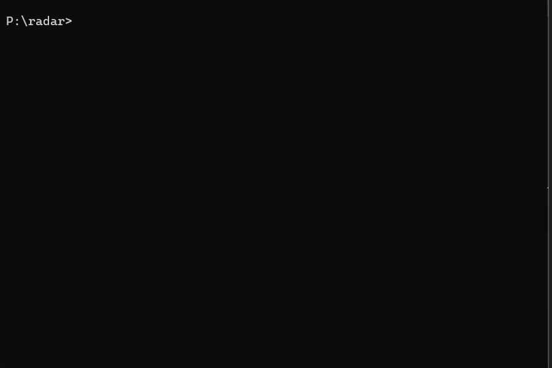

# radar

### Your open work across every repo, in the terminal. No dashboard, no signup.

<!-- Replace with the demo GIF: radar wip -> radar log -> radar log --recap -->


You have PRs open in five repos, two issues assigned in a third, and a review someone's
waiting on in a fourth. GitHub has no single screen that shows you *your own open work*
across all of it. `radar` does — from the terminal, in one command, using the `gh` login
you already have.

```
radar wip - @you  (day=UTC, as of 2026-06-20 08:20Z)
============================================================

YOUR OPEN PRs  (11)
  acme/web#357    feat(onboarding): add rotating repo name ticker
  acme/api#411    feat(cost): cost-aware model router for task complexity
  you/sqlc#4473   Expose source_tables on the plugin Query message
  org/legacy#1    feat: add comment CRUD APIs with tests   [STALE 208d]

AWAITING YOUR REVIEW  (2)
  acme/web#360    chore: bump deps

ISSUES ASSIGNED TO YOU  (7)
  acme/api#398    [Premium] HIPAA Compliance & EU AI Act gap analysis
  ...
------------------------------------------------------------
20 items in flight: 11 PRs, 2 to review, 7 issues, 1 stale (>14d).
```

## Why

- **One in-flow view.** Stop tab-hopping across repos and the notifications inbox to
  reconstruct what you're actually on the hook for.
- **Stale radar.** The thing you forgot two weeks ago gets a `[STALE Nd]` flag, not silence.
- **Zero setup.** No OAuth dance, no API key, no account. If `gh` is logged in, `radar` works.
- **Year-round.** Not tied to any program, season, or leaderboard — it's just your work.

## Install

`radar` is a Claude Code skill. Two ways in:

### Option A — Claude Code plugin (recommended)

```
/plugin marketplace add Prateeks16/radar
/plugin install radar@radar
```

### Option B — manual copy

Copy the skill into your Claude skills directory:

```bash
# macOS / Linux
cp -r plugins/radar/skills/radar ~/.claude/skills/radar

# Windows (PowerShell)
Copy-Item -Recurse plugins\radar\skills\radar $HOME\.claude\skills\radar
```

Either way, you then talk to it naturally ("what am I working on?", "what did I merge this
week?", "give me a recap card") or run the script directly:

```bash
python ~/.claude/skills/radar/scripts/radar.py wip
```

## Usage

| Command | What it shows |
|---|---|
| `radar wip` *(default)* | Open PRs you authored + PRs awaiting your review + issues assigned to you, with stale flags. |
| `radar log [--since YYYY-MM-DD]` | Merged/closed history (default: last 30 days). Saved to a local log. |
| `radar log --recap` | An ASCII card of your logged history — built to paste anywhere. |

```
+------------------------------------------------+
| radar recap  @you                              |
| 2026-06-07 -> 2026-06-20  (day=UTC)            |
+------------------------------------------------+
|                                                |
|      7  PRs merged                             |
|      2  other items closed                     |
|      3  repos touched                          |
|                                                |
|   most-merged:                                 |
|       4x acme/web                              |
|       3x acme/api                              |
|                                                |
|   radar - open work in your terminal           |
+------------------------------------------------+
```

## Requirements

- [GitHub CLI](https://cli.github.com) (`gh`), authenticated: `gh auth login`
- Python 3.8+ (standard library only — no `pip install`)

## Configuration

One optional knob, at `~/.claude/radar/config.json`:

```json
{ "stale_days": 14 }
```

Lower it for a twitchier stale flag, raise it if you work in longer cycles.

## Known limits

- **Token scope.** `radar` sees what your `gh` token can see. Private/org repos outside
  its scope, and review/assignment in those repos, won't appear.
- **Search-index lag.** GitHub's search backend can trail reality by a minute or two; a
  just-opened PR may not show on the very next run.
- **Authored PRs only** in the "YOUR OPEN PRs" section.
- **Dates are UTC.** Every day boundary is anchored to UTC (so it matches GitHub's search)
  and the output says `day=UTC`. This is deliberate — local-time boundaries cause
  off-by-one errors at the edges of a day.

## License

MIT — see [LICENSE](LICENSE).
